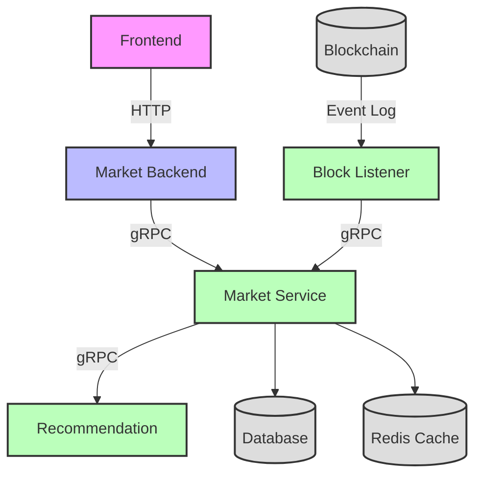

# Block Listener

Block Listener is a blockchain monitoring service that listens to on-chain events and updates business data via gRPC calls to downstream services.

## System Architecture



## Project Description

- Monitors blockchain events in real-time
- Processes prediction market events (creation, trading, settlement)
- Updates business data via gRPC calls to market-service
- Supports multiple RPC endpoints with automatic failover
- Handles batch processing for improved performance

### Key Features

- **Real-time Event Monitoring**: Continuously scans blockchain for relevant events
- **Event Processing**: Parses and processes prediction market events
- **Data Synchronization**: Updates downstream services with latest blockchain data
- **Multi-RPC Support**: Automatic switching between multiple RPC endpoints
- **Batch Operations**: Efficient batch processing using MultiCall contracts

## Project Structure

```
block-listener/
├── cmd/                             # Main program entry directory
│   └── block-listener/              # Service startup entry
├── internal/                        # Internal package directory
│   ├── biz/                         # Business logic layer
│   │   ├── block_scanner.go         # Block scanning logic
│   │   └── event_processor.go       # Event processing logic
│   ├── conf/                        # Configuration structure definitions
│   ├── contract/                    # Smart contract interfaces
│   ├── data/                        # Data access layer
│   │   └── arb_client.go           # Arbitrum client with MultiCall support
│   ├── model/                       # Data models
│   ├── rpc/                         # gRPC client configuration
│   └── server/                      # Server configuration
├── pkg/                             # Shared utility packages
│   ├── alarm/                       # Alarm notifications
│   └── common/                      # Common utilities
├── configs/                         # Configuration files directory
├── bin/                             # Compiled output directory
├── logs/                            # Log directory
├── Dockerfile                       # Docker build file
├── docker-compose.yml               # Docker compose file
├── Makefile                         # Project build script
├── go.mod                           # Go module definition
├── go.sum                           # Go dependency version lock
└── README.md                        # Project documentation
```

### Directory Description

#### Core Directories

- **`cmd/`**: Application entry point with dependency injection configuration
- **`internal/`**: Internal packages containing all business logic

#### Internal Directory Details

- **`biz/`**: Business logic layer, contains block scanning and event processing
- **`data/`**: Data access layer, handles blockchain interactions and gRPC calls
- **`contract/`**: Smart contract interfaces and ABI definitions
- **`model/`**: Data models for events and blockchain data
- **`conf/`**: Configuration structure definitions
- **`rpc/`**: gRPC client configuration for downstream services
- **`server/`**: Server initialization and lifecycle management

#### Shared Packages

- **`pkg/`**: Shared utility packages for alarm and common functions

## Tech Stack

- Go 1.21
- Kratos Framework
- gRPC
- Ethereum Go Client
- Protocol Buffers
- Docker

## Quick Start

### Local Development

1. Install dependencies:

```bash
make init
```

2. Generate API code:

```bash
make api
```

3. Build project:

```bash
make build
```

4. Run service:

```bash
make run
```

### Docker Deployment

```bash
# Start service
docker compose up -d --build
```

### Configuration

Service configuration is located at `configs/config.yaml`:

```yaml
server:
  grpc:
    addr: :9000
    timeout: 1s

data:
  blockchain:
    arb_rpc_urls:
      - "https://arb1.arbitrum.io/rpc"
      - "https://arbitrum-one.publicnode.com"
    start_block: 123456789
    batch_size: 100
    scan_interval: 5s

  marketcenter_rpc:
    addr: market-service:9000
    timeout: 10s
  usercenter_rpc:
    addr: market-service:9000
    timeout: 10s
```

## Key Components

### Block Scanner

- Continuously monitors blockchain for new blocks
- Handles block range scanning with configurable batch sizes
- Supports resuming from last processed block

### Event Processor

- Processes prediction market events (creation, trading, settlement)
- Batch queries blockchain data using MultiCall contracts
- Updates downstream services via gRPC

### Arbitrum Client

- Multi-RPC endpoint support with automatic failover
- Health monitoring and automatic switching
- Batch operations using MultiCall2/MultiCall3 contracts

## License

MIT License
