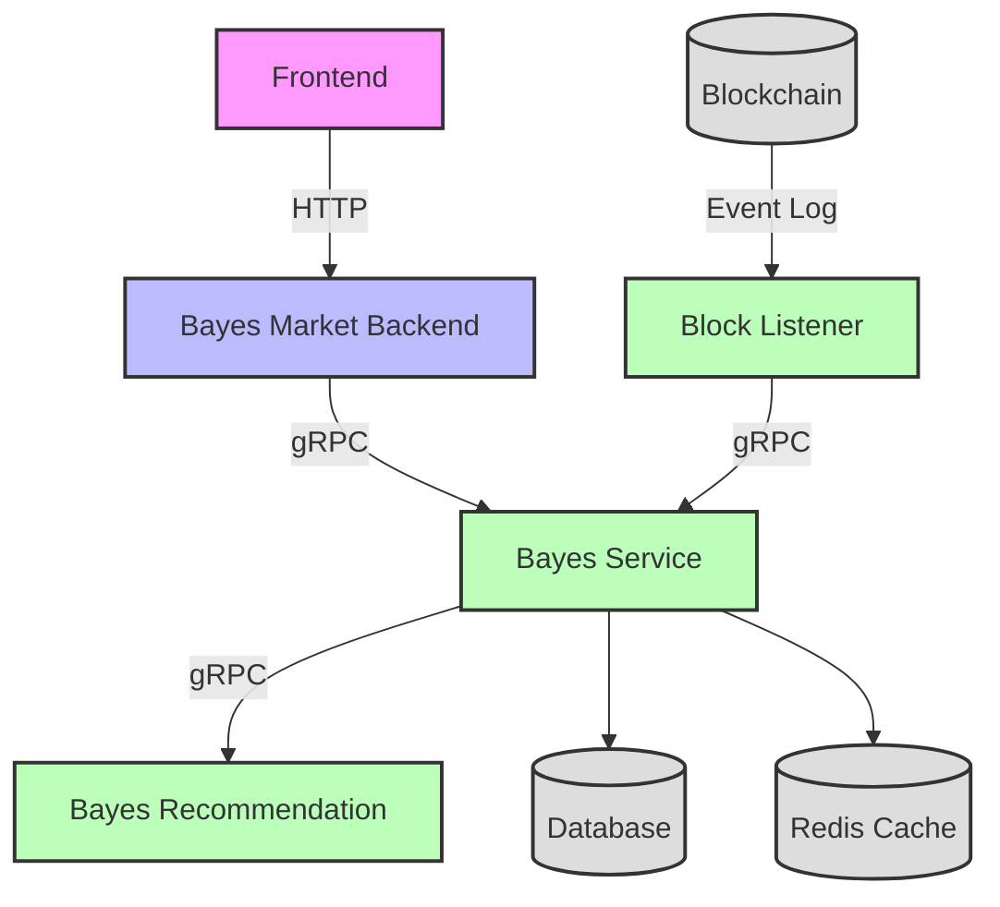

# Bayes Market Backend

Bayes Market Backend BFF service, serving as an intermediary layer between frontend and microservices, providing HTTP interfaces to frontend and calling downstream market-service microservices via gRPC.

## System Architecture



## Project Description

- This service acts as a BFF (Backend For Frontend) layer
- Does not directly depend on storage layer (DB/Cache)
- Calls downstream market-service microservices via gRPC
- Provides HTTP interfaces to frontend
- Handles data aggregation, format conversion and other business logic

### Microservices Architecture

The system consists of multiple microservices:

- **Bayes Market Backend (BFF)**: Frontend gateway service providing HTTP APIs
- **Bayes Service**: Core business logic service handling market data, trading, and user management
- **Bayes Recommendation**: AI/ML service providing embedding and recommendation algorithms
- **Block Listener**: Blockchain monitoring service that listens to on-chain events and updates business data

## Project Structure

```
market-backend/
├── api/                              # API definition directory
│   └── bayes/                       # API namespace
│       └── v1/                      # V1 version API definitions
├── cmd/                             # Main program entry directory
│   └── market-backend/        # Service startup entry
├── internal/                        # Internal package directory (not exposed)
│   ├── alarm/                       # Alarm module
│   ├── conf/                        # Configuration structure definitions
│   ├── data/                        # Data access layer
│   ├── pkg/                         # Internal utility package
│   │   ├── middleware/              # Middleware
│   │   └── util/                    # Utility functions
│   ├── rpc/                         # gRPC client configuration
│   ├── server/                      # Server configuration
│   └── service/                     # Service implementation layer
├── third_party/                     # Third-party proto dependencies
├── configs/                         # Configuration files directory
├── bin/                             # Compiled output directory
├── logs/                            # Log directory
├── sql/                             # SQL scripts directory
│   └── migration/                   # Database migration scripts
├── Dockerfile                       # Docker build file
├── docker-compose.yml               # Docker compose file
├── Makefile                         # Project build script
├── go.mod                           # Go module definition
├── go.sum                           # Go dependency version lock
├── openapi.yaml                     # Generated OpenAPI documentation
└── README.md                        # Project documentation
```

### Directory Description

#### Core Directories
- **`api/`**: Contains all API definition files (.proto), generates corresponding Go code via protoc
- **`cmd/`**: Application entry point, contains main function and dependency injection configuration
- **`internal/`**: Internal packages, not exposed externally, contains all business logic

#### Internal Directory Details
- **`service/`**: Service implementation layer, implements business logic defined in APIs
- **`data/`**: Data access layer, responsible for communicating with downstream gRPC services
- **`server/`**: Server configuration, contains HTTP and gRPC server initialization
- **`conf/`**: Configuration structure definitions, defines configuration format via proto
- **`pkg/`**: Internal utility package, contains middleware, utility functions, etc.
- **`rpc/`**: gRPC client configuration and initialization
- **`alarm/`**: Alarm-related functional modules

#### Auxiliary Directories
- **`third_party/`**: Third-party proto files, such as Google API, validation rules, etc.
- **`configs/`**: Configuration files, supports different environment configurations
- **`bin/`**: Compiled output directory
- **`logs/`**: Log file storage directory
- **`sql/`**: Database-related scripts

## Tech Stack

- Go 1.21
- Kratos Framework
- gRPC + HTTP
- Protocol Buffers
- Docker

## Quick Start

### Local Development

1. Install dependencies:
```bash
make init
```

2. Generate API code:
```bash
make api
```

3. Build project:
```bash
make build
```

4. Run service:
```bash
make run
```

### Docker Deployment

```bash
# Start service
docker compose up -d --build
```

### Configuration

Service configuration is located at `configs/config.yaml`:

```yaml
server:
  http:
    addr: :8000
    timeout: 1s
  grpc:
    addr: :9000
    timeout: 1s
client:
  bayes:
    target: dns:///market-service:9000
    timeout: 1s
```

## Error Handling

Unified error response format:

```json
{
  "code": 500,
  "msg": "Error message",
  "data": null
}
```

Common error codes:
- `400`: client error
- `500`: server error


## License

MIT License
