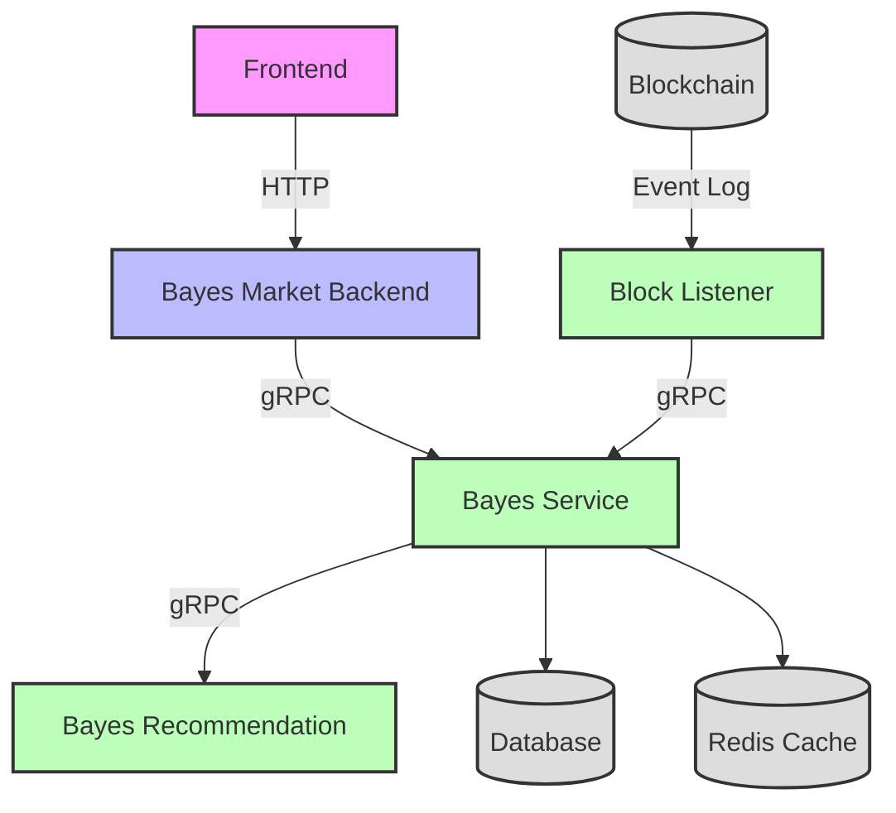

# Bayes Service

Bayes Service is the core microservice providing business logic for the Bayes prediction market platform. It handles market data, trading operations, user management, and asset management through gRPC interfaces.

## System Architecture



## Project Description

- This service is the core business logic microservice in the Bayes prediction market system
- Provides gRPC interfaces for upstream BFF services
- Directly manages database and cache operations
- Handles core business logic including market management, trading, user management, and asset operations
- Integrates with blockchain through event listeners and transaction processing

### Microservices Architecture

The system consists of multiple microservices:

- **Bayes Market Backend (BFF)**: Frontend gateway service providing HTTP APIs
- **Bayes Service**: Core business logic service handling market data, trading, and user management
- **Bayes Recommendation**: AI/ML service providing embedding and recommendation algorithms
- **Block Listener**: Blockchain monitoring service that listens to on-chain events and updates business data

## Project Structure

```
market-service/
├── api/                              # API definition directory
│   ├── marketcenter/                # Market center API definitions
│   ├── usercenter/                  # User center API definitions
│   └── rpc/                         # Internal RPC definitions
├── cmd/                             # Main program entry directory
│   └── market-service/               # Service startup entry
├── internal/                        # Internal package directory (not exposed)
│   ├── biz/                         # Business logic layer
│   │   ├── asset/                   # Asset management business logic
│   │   ├── market/                  # Market management business logic
│   │   ├── user/                    # User management business logic
│   │   ├── community/               # Community features business logic
│   │   └── base/                    # Base business logic components
│   ├── data/                        # Data access layer
│   ├── service/                     # Service implementation layer
│   ├── server/                      # Server configuration
│   ├── conf/                        # Configuration structure definitions
│   ├── model/                       # Data models
│   ├── pkg/                         # Internal utility package
│   └── task/                        # Background task processing
├── middleware/                      # Middleware components
├── third_party/                     # Third-party proto dependencies
├── sql/                             # SQL scripts directory
├── bin/                             # Compiled output directory
├── all_test/                        # Test files directory
├── Dockerfile                       # Docker build file
├── docker-compose.yml               # Docker compose file
├── Makefile                         # Project build script
├── go.mod                           # Go module definition
├── go.sum                           # Go dependency version lock
├── openapi.yaml                     # Generated OpenAPI documentation
└── README.md                        # Project documentation
```

### Directory Description

#### Core Directories
- **`api/`**: Contains all API definition files (.proto), generates corresponding Go code via protoc
- **`cmd/`**: Application entry point, contains main function and dependency injection configuration
- **`internal/`**: Internal packages, not exposed externally, contains all business logic

#### Internal Directory Details
- **`biz/`**: Business logic layer, contains core business logic for different domains
  - **`asset/`**: Asset and token balance management
  - **`market/`**: Prediction market operations and management
  - **`user/`**: User account and profile management
  - **`community/`**: Community features and social interactions
  - **`base/`**: Common business logic components
- **`service/`**: Service implementation layer, implements business logic defined in APIs
- **`data/`**: Data access layer, responsible for database and cache operations
- **`server/`**: Server configuration, contains HTTP and gRPC server initialization
- **`conf/`**: Configuration structure definitions, defines configuration format via proto
- **`model/`**: Data models and database entity definitions
- **`pkg/`**: Internal utility package, contains middleware, utility functions, etc.
- **`task/`**: Background task processing and scheduled jobs

#### Auxiliary Directories
- **`middleware/`**: Middleware components for request processing
- **`third_party/`**: Third-party proto files, such as Google API, validation rules, etc.
- **`sql/`**: Database-related scripts and migrations
- **`bin/`**: Compiled output directory
- **`all_test/`**: Test files and test utilities

## Tech Stack

- Go 1.21
- Kratos Framework
- gRPC + HTTP
- Protocol Buffers
- PostgreSQL
- Redis
- GORM
- Ethereum Integration
- Docker

## Quick Start

### Local Development

1. Install dependencies:
```bash
make init
```

2. Generate API code:
```bash
make api
```

3. Build project:
```bash
make build
```

4. Run service:
```bash
make run
```

### Docker Deployment

```bash
# Start service
docker compose up -d --build
```

### Docker Support (Enhanced)

The service now supports running in Docker, especially for Linux environment compilation.

#### Quick Start

For local development with Docker:

```bash
# Build Docker image and start container
make docker-local-dev

# View container logs
docker logs -f market-service
```

### Configuration

Service configuration supports multiple environments. Example configuration structure:

```yaml
server:
  http:
    addr: :8000
    timeout: 1s
  grpc:
    addr: :9000
    timeout: 1s
database:
  driver: postgres
  source: "host=localhost user=postgres password=password dbname=bayes port=5432 sslmode=disable"
redis:
  addr: localhost:6379
  password: ""
  db: 0
```

## Business Modules

### Asset Management
- User token balance tracking
- Asset value calculation
- Transaction history
- Portfolio management

### Market Management
- Prediction market creation and management
- Market resolution and settlement
- Order book management
- Trading operations

### User Management
- User registration and authentication
- Profile management
- Activity tracking
- Reputation system

### Community Features
- Social interactions
- Content management
- Recommendation system integration

## Error Handling

Unified error response format:

```json
{
  "code": 500,
  "msg": "Error message",
  "data": null
}
```

Common error codes:
- `400`: client error
- `500`: server error

## License

MIT License
